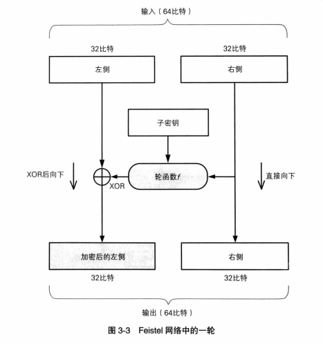
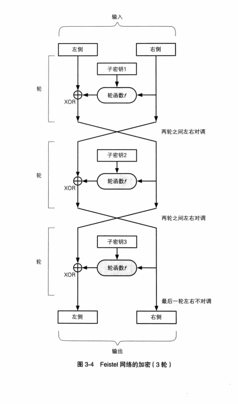
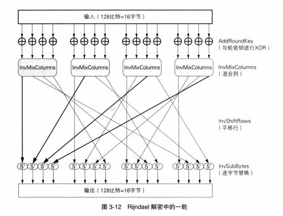
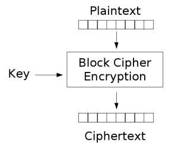
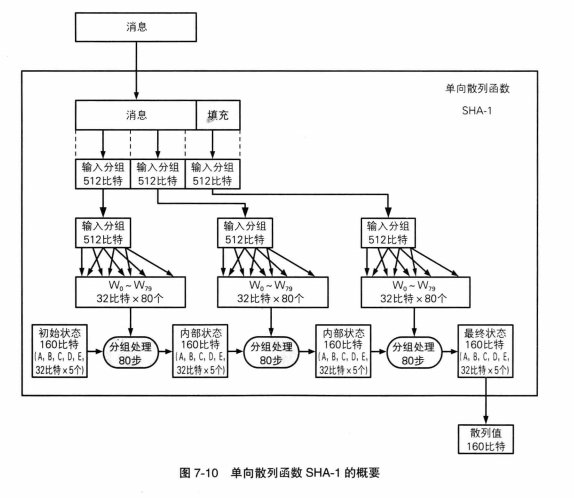
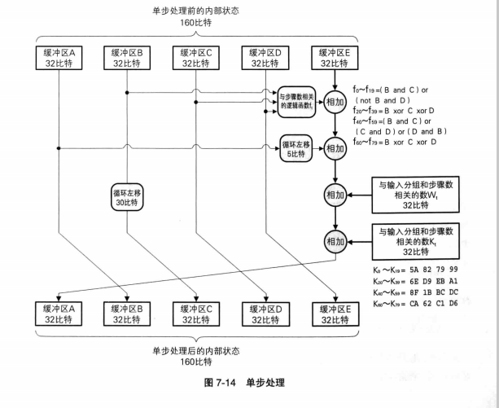

### 对称密码
计算机操作对象是0、1字符串，把字母字符等映射成数字，这个对字母字符进行逐一编码的规则叫做ASCII。


#### 一次性密码本
+ 一次性密码本（One-time Pad；OTP）是密码学中的一种加密算法。是以随机的密钥（key）组成明文，且只使用一次。
+ 性能：超高（无法暴力破解）
+ 加密方法：将明文通过ASCII表写成0、1串的形式，然后随机生成一个等长度的0、1串作为密钥，最后对两个串进行XOR的异或运算得到相应的密文。
+ 例子：
```
01101101 01101001 01100100 01101110 01101001 01100111 01101000 01110100   明文
                                   XOR
01101011 11111010 01001000 11011000 01100101 11010101 10101111 00011100   密钥
00000110 10010011 00101100 10110110 00001100 10110010 11000111 01101000   密文
```
解密：如果知道密钥，然后对密钥和密文进行XOR异或就可以得到明文。
```
CTF长征一小步
为什么一次性密码本是无法破译的？

因为密钥是随机生成毫无规律的，如果事先不知道密钥是没有办法得到明文的。假如是10bit，暴力破解的话就要尝试2^10种情况，所以得到明文的几率是非常非常小的。

CTF长征小半步
bit、byte、word的概念和关系。
1、位（Bit）：“位”或“比特”，是计算机运算的基础；
2、字节（Byte）：“字节”是通过网络传输信息（或在硬盘或内存中存储信息）的单位。字节是计算机信息技术用于计量存储容量和传输容量的一种计量单位，1个字节等于8位二进制。
3、在ASCII码中，一个英文字母（不分大小写）占一个字节的空间，一个中文汉字占两个字节的空间。
4、符号：英文标点占一个字节，中文标点占两个字节。举例：英文句号“.”占1个字节的大小，中文句号“。”占2个字节的大小
5、一个二进制数字序列,在计算机中作为一个数字单元,一般为8位二进制数，如一个ASCII码就是一个字节.
6、字（WORD），2个字节组成一个字。
7、双字（DWORD），4个字节组成一个双字。
```

#### DES
DES是将64比特明文加密成64比特密文的`对称密码算法`，它的`密钥长度`为56比特，在密钥中每隔`7比特`就会插入一个用于错误检查的比特,所以一共64比特。
DES是以`64比特`明文为一个单位来进行加密的，这64比特的一个单位成为一个分组，所以DES也是分组密码的一种。DES每次只能加密64比特的数据，如果加密的明文比较长就需要对DES加密过程进行迭代，迭代的加密方式称为模式，详见分组密码。
### DES结构（Feistel网络）
DES结构也叫Feistel网络，在Feistel网络中，加密的各个步骤成为`轮`，整个加密过程，就是若干次轮的循环。下图展示Feistel网络的一轮计算，DES是16轮循环的Feistel网络



 中间的子密钥指本轮加密的密钥，Feistel网络每轮使用不同的子密钥。`轮函数`可以根据“右侧”和子密钥生成对“左侧”进行加密的比特序列。然后，我们用XOR将轮函数的输出与“左侧”进行合并。<br>
 每一轮的具体计算过程如下：<br>
 - 输入数据等分成左右两分。
 - 输入的右侧直接发送到输出的左侧。
 - 输入的右侧发送到轮函数。
 - 轮函数根据右侧数据和子密钥，计算出一串看上去随机的比特序列
 - 上一步的比特序列与左侧数据进行XOR运算，并把结果作为加密的左侧。
 通过上述过程，可以看到，右侧并没有被加密，所以我们需要用不同的子密钥对一轮的处理多次，并在每两轮处理之间将左右数据对调。就像下面的模型图<br>
 
 
<br>
#### DES解密
DES的解密可以使用和加密完全相同的结构，只需要按照相反的顺序来使用子密钥就可以了。也就是说，用相同的子密钥运行两次Feistel网络，就可以实现“明文->密文->明文”的过程。同理，多轮的Feistel网络，只需要按照n->1的顺序使用子密钥就可以实现解密。


#### 三重DES

三重DES（3DES）就是将DES重复三次得到的一种密码算法。明文经三次DES处理才会变成密文，由于DES的密钥是56比特，所以3DES的密钥长度是168比特。三重DES的加密过程是“加密->解密->加密”。
三重DES的解密过程，刚好和加密过程相反，是执行“解密->加密->解密”的操作。

#### AES
Rijndael分组密码算法于2000年被选为新一代AES。Rijndael分组长度为128比特，密钥长度以32item为单位，在128比特到256比特范围内选择。该算法由多个轮组成，使用SPN结构。
Rijndael输入分组128比特，Rijindael的加密过程分四步：

+ 首先SubBytes处理,逐字节的对16字节的输入进行处理。以每个字节的值为索引，从一张替换表中找到对应得值。也就是将一个字节的值换成另一个字节的值。
+ 其次ShiftRows处理：将上一步输出以字节为单位进行打乱处理。
+ MixColumns处理，对四字节的值进行比特运算，把他变成另一个4字节的值。
+ AddRoundKey处理，将MixColumns的输出与轮密钥进行XOR。

在Rijndael中，需要进行10~14轮上述运算。每轮计算模型如下图所示


<br>
Rijindael不能像Feistel一样用同一结构实现加解密，而是通过每一步都进行反向运算来实现解密。
<br>

#### 分组密码
分组密码是一种对称密钥算法。它将明文分成多个等长的块，使用确定的算法和对称密钥对每组分别加密解密。典型的分组大小是64位或128位



分组密码算法只能加密固定长度的分组，若要加密超过分组密码长度的明文，就需要对分组密码进行迭代，迭代后的最后一块数据需要使用合适的填充方式将数据扩展到与分组长度相等的长度。这种迭代的方法我们称为分组密码的模式 分组密码的模式主要有下列5种： ECB（Electronic CodeBook mode）：电子密码本模式 CBC（Cipher Block Chaining mode）：密码分组链接模式 CFB（Cipher FeedBack mode）：密文反馈模式 OFB（Output FeedBack mode）：输出反馈模式 CTR（CounTeR mode）：计数器模式

五种密码的介绍详细：
https://github.com/DigBullTech-sec0cr/Cryptology/blob/master/Tutorials/%E5%AF%86%E7%A0%81%E5%AD%A6%E5%9F%BA%E7%A1%80%EF%BC%88%E4%B8%89%EF%BC%89.md

### 公钥密码
公钥密码中，密钥分为加密密钥和解密秘钥两种。加密密钥一般是公开的，称为公钥。解密秘钥由自己保存绝不公开，称为私钥。公钥和私钥统称为密钥对
#### RSA

+ 加密：密文=明文^E mod N
+ 解密：明文=密文^D mod N (a^c表示a的c次方)。
+ 公钥：（E,N)； 私钥：（D,N）
   
如何生成密钥对呢？？？

```
1. 生成N
   N=p* q(p,q是两个非常大的质数)
2. 生成L（L是生成秘钥对过程中使用的数）
   L=lcm(p-1,q-1) (L是p-1和q-1的最小公倍数)
3. 生成E
   1<E<L
   gcd(E,L)=1(E,L的最大公约数为1)
   检查E,L的最大公约数是否为1，可以用辗转相除法求公约数。感兴趣的同学可以自行拓展，在此不做赘述。<br>
4. 生成D
   1<D<L
   E* DmodL=1
```
#### 中间人攻击
中间人攻击是一种针对机密性的有效攻击。攻击者混入发送者和接收者之间，对发送者伪装成接受者，对接收者伪装成发送者。
## 单向散列函数
`单向散列函数`也叫`哈希函数`，它有一个输入和一个输出，输入称为消息，输出称为散列值，也叫信息摘要或者指纹<br>
单向散列函数是一种采集文件指纹的技术，单向散列函数产生的散列值，相当于消息的指纹。可以用来检测软件是否被篡改。<br>
单向散列函数可以根据任意长度的消息计算出固定长度的散列值，能够跨苏计算出散列值，消息不统计算出来的散列值也不一样，并且具备单向性。<br>
- 应用<br>
1. 根据单向散列函数计算出的散列值（哈希值）可以检测软件是否被篡改。<br>
2. 单向散列函数可用于基于口令的加密。
3. 单向散列函数可以构造消息认证码。
4. 数字签名也会用到单向散列函数。
5. 使用单向散列函数可以构造伪随机数生成器。
6. 利用单相思浓烈函数可以构造一次性口令。

### SHA-1
`SHA-1`是哈希函数的一种。它能够从最大2^64比特的消息中计算出160比特的散列值。<br>



<br>
*SHA-1函数的运行总共有四个步骤*

##### 1.填充
sha-1函数的消息长度在0~ 2^64比特之间。每512比特为一个输入分组，若长度不是512比特的整数倍就需要对sha-1信息进行填充。<br>
填充方法是：在消息末尾添加1比特的“1”，在“1”后面联系添加“0”，直到消息长度为512比特的整数倍。但是最后一个分组的最后64比特空出来保存原始信息长度。<br>

##### 2.计算W0~ W79
SHA-1的计算是以输入分组为单位计算的。每个输入分组计算出80个32比特。这些值用到第四步的计算中。首先，一个输入分组分成16组32比特信息，命名为`W0~W15`。<br>
剩余的`W16~W79`的计算方法：Wt=Wt-16 XOR Wt-14 XOR Wt-8 XOR Wt-3循环左移1比特。<br>

##### 3.分组处理
分组处理是为了将输入分组的512比特数据和SHA-1保持的160比特的内部状态（五个缓冲区）进行混合，SHA-1最终输出的160比特散列值，就是处理结束后的内部状态。下图展示的就是输入分组与五个缓冲区是怎么混合的！


##### 4.单步处理
分组处理的80个步骤中的每一步的详细过程都是如下图所示。主要是为了使内部状态（缓冲区A,B,C,D,E）产生变化。




### [MD5](http://blog.csdn.net/xiaofengcanyuexj/article/details/37698801)
MD5即信息摘要算法第五版。是一种有广泛应用的哈希函数。用来提供消息的完整性保护。他能够对消息产生128比特的散列值。<br>
MD5是一种不可逆的算法，通过信息摘要算法得到的信息是不完整的，所以也不能得到原始数据。<br>
MD5以512比特信息分组来处理输入的信息，每一个分组又被划分成16组32比特分组。经一系列的算法变化得到4个32比特分组，这个四个32比特分组生成128比特的散列值。<br>
在网上经常会看到32位和16位的MD5值，两者是有部分相同的，32位的MD5值去掉前八位和后八位就是16位了。<br>
**MD5算法流程**
1. 填充
- 参考SHA-1。
2. 设置4个初始参数<br>
- 第一组输入分组需要设置4个32位的链接变量：A=0x01234567;B=0x89abcdef;C=0xfedcba98;D=0x76543210；用来计算信息摘要。
- 四个链接变量复制到a,b,c,d。
- 第二组及后面的输入分组的初始变量是上一组的运算结果。
3. 对输入数据做变换<br>
主循环是4轮操作，每轮操作有16次操作，每次操作是对A,B,C,D中的3个做非线性操作，所得结果加上第4个变量。
- F(X,Y,Z)=(X&Y)|((~X)&Z)
- G(X,Y,Z)=(X&Z)|(Y&(~Z))
- H(X,Y,Z)=X^Y^Z
- I(X,Y,Z)=Y^(X|(~Z))
(&代表与，~代表反，^代表异或，|代表或)<br>

#####  应用
1. 防止被篡改
2. 防治直接看到明文
3. 防止抵赖


这里有CTF可能用到的密码的形试和工具，大家自行体验一把。<br>
- [CTF中那些脑洞大开的编码和加密](http://www.360doc.com/content/16/0906/21/27425026_588911412.shtml)
- [CTFtools](https://www.ctftools.com/)
