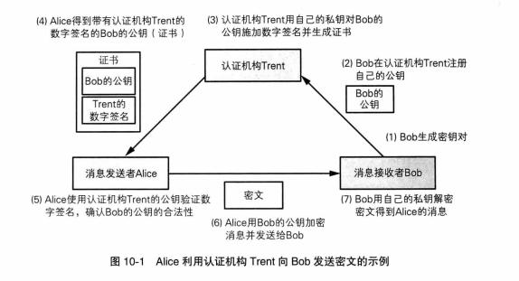

### 密码学基础（四）
### 消息认证码
消息的认证指的是“消息来自正确的发送者”这一属性。也就是确认消息不是由其他人伪装成发送者发出的 

它可以接受任意长度的消息和一个发送者与接受者之间的共享秘钥，并输出固定长度的数据，这个数据称为MAC值。也称为：带密钥的Hash函数。 

### HMAC

1.填充密钥 
如果密钥比单向散列函数单的分组长度短，就需要在末尾填充0，直到密钥长度和单向散列函数分组长度一致； 
2.密钥与ipad进行XOR 
ipad是将00110110这一序列不断循环知道达到分组长度形成的比特序列。用填充后的密钥跟ipad进行XOR运算。XOR得到的值称为ipadkey。 
3.与消息结合 
把ipadkey的比特序列附加在消息开头。 
4.计算散列值 
将ipadkey与消息组合后得到的比特序列输入单向散列函数，并计算散列值。 
5.填充后的秘钥与opad进行XOR计算。 
opad是将01011100这一比特序列不断循环直到长度达到分组长度所形成的比特序列。用填充后的密钥和opad进行XOR运算，得到的结果称为opadkey。 
6.组合 
把上述4得到的散列值拼在opadkey后面。 
7.计算散列值 
把上述6得到的序列输入单向散列函数，并计算散列值，这个散列值就是最终的消息认证码（MAC）。 

### 重放攻击
重放攻击是指攻击者发送一个目的主机已接收过的包，特别是在认证的过程中，用于认证用户身份所接收的包，来达到欺骗系统的目的，主要用于身份认证过程，破坏认证的安全性
例子：小王向某个不能有效识别付款（这里指不能判断是哪一笔付款）的包子铺买包子，当他把用支付宝成功付款的付款信息出示给服务员后， 服务员把包子给他。 然后小王又再把上次的付款信息出示给另一个服务员， 服务员又给他一份包子。 只要小王不断重复出示他的付款信息，就可以源源不断骗得包子， 这对于包子铺来说就是被重放攻击了， 损失了无数包子。 
用Burp Suite实现重放攻击：https://www.cnblogs.com/jmjm/p/7875607.html 

### 预防重放攻击
1、序号 约定每一次都发送的消息赋予一个递增的编号（序号）。 
2、时间戳 约定在发送时包含当前的时间，如果收到以前的信息，即使MAC值正确也当做错误信息处理。 
3、nonce 在通信之前，接受者先向发送者发送一个一次性的随机数，这个随机数称为nonce,发送者在消息中包含这个nonce并计算MAC值，有一每次发送的nonce不同，所以也就不能进行重放攻击 

### HMAC的缺陷
1、接受者B接收到来自发送者A的消息之后，不能向第三方证明消息来自发送者A。
2、接受者B收到包含MAC的消息，可以利用发送者A和接受者B的密钥计算出来，从而接受者B能够确定消息来自发送者A，但是发送者A可以否认消息来自它。因为没有人可以证实消息确实来自发送者A。也就是消息认证码无法防止否认

### 数字签名
数字签名的作用就是防止抵赖。数字签名不具有机密性，它生成的密文仅用于代表只有持有该密钥的人才能够生产的信息，所以数字签名可以直接发送消息明文，用于对比。 

### 数字签名的生成和验证
数签名对签名密钥和验证密钥进行了区分，签名密钥只有签名的人才持有，验证密钥任何人都可以拥有。 数字签名对签名密钥和验证密钥进行区分，使用验证密钥无法生成密钥。 可以直接对消息签名，也可以对消息的散列值签名。 

### 数字签名的方法
直接对消息进行签名
1、发送者A用自己的私钥对消息进行加密，加密的结果就是生成的数字签名 
2、发送者A将消息和生成的数字签名发送出去 
3、接受者B用发送者A的公钥对数字签名进行解密
4、接受者B将签名解密后的消息和发送者A发送的消息进行对比 

对消息的散列值签名 
1.发送者A用单项散列函数计算消息的散列值 
2.发送者A用自己的私钥对消息进行加密，加密的结果就是生成的数字签名 
3.发送者A将消息和生成的数字签名发送出去 
4.接受者B用发送者A的公钥对数字签名进行解密 
5.接受者B将签名解密后的消息和发送者A发送的消息进行对比 

### 证书
公钥证书简称证书，是记载了个人信息和属于个人的公钥。并由认证机构施加数字签名。证书的作用是对公钥的合法性提供证明。只要有证书，我们就知道有认证机构确认该公钥的确属于此人。认证机构就是明确公钥属于此人并生成数字签名的个人或组织 

### 公钥基础设施
公钥基础设施（PKI）是为了能够更有效地运用公钥制定的一些列规范和规格的总称。并非指某一种规范或规格。公钥基础设施（PKI）是为了能够更有效地运用公钥制定的一些列规范和规格的总称。并非指某一种规范或规格。 
PKI组成要素：
用户：使用PKI的人； 
认证机构：颁发证书的人； 
仓库：保存证书的数据库。 认证机构的工作： 

生成密钥对:生成密钥对有两种方法：一种是PKI自己生成；另一种是认证机构生成。 
注册证书。 当用户自行生成密钥对时，用户会请求认证机构来生成证书。生成那个证书时，会使用认证机构的私钥来进行数字签名。 
作废证书和CRL 当用户的私钥丢失，被盗时，认证机构需要对证书进行作废。要作废证书，认证机构先要制作一份作废证书清单（CRL）。总的来说，当我们手上有一份证书时，仅凭证书上的认证机构签名和有效期，并不能确定证书是否有效，还需要查询认证机构最新的CRL，看证书是否有效。 

### 对证书的攻击
在公钥注册之前进行攻击 
在施加数字签名前对公钥进行攻击，比如把用来数字签名的公钥替换成主动攻击者的公钥 
注册相似人名进行攻击、窃取认证机构的私钥进行攻击。 
攻击者伪装成认证机构进行攻击 
钻CRL空子进行攻击，从公钥失效到收到CRL需要经过一段时间，可以利用这个时间差发动攻击。 

### Diffie-Hellman密钥交换
Diffie-Hellman密钥交换可以使通信双方仅通过交换一些可以公开的信息就能够生成共享的秘密数字。这种方法虽然叫密钥交换，但实际上方并没有真的交换密钥，而是通过计算生成一个相同的共享密钥。 
Diffie-Hellman密钥交换的步骤 
发送者向接受者发送两个质数P和G，P是一个非常大的质数，G是一个与P相关的数。 
发送者生成一个随机数A，A是1到P-2之间的一个整数。这个数只有发送者知道。 
接受者生成一个随机数B，B也是1到P-2之间的整数。这个数只有接受者知道。 
发送者将G^A mod P这个数发送给接受者。 
接受者将G^B mod P这个数发送给发送者。 
发送者将接受者发来的数计算A次方并求mod P. 
接受者用发送者发过来的数计算B次方并求mod P 

# 基于口令的密码（PBE）

基于口令的密码是一种根据口令生成密钥并用该密钥进行加密的方法。加密解密使用同一个密钥。 PBE加密包含三个步骤： 
1.生成KEK。使用伪随机数生成器生成一个成为盐的随机数，把盐和发送者输入的口令一起输入单向散列函数，得到的散列值就是用来加密密钥的密钥（KEK）。 
2.生成会话密钥并加密。使用伪随机数生成器生成会话秘钥，会话秘钥用来解密消息。会话秘钥使用KEK加密，并和盐一起保存在安全的地方。会话秘钥加密后KEK会被丢弃。 
3.加密消息。用会话密钥对消息进行加密。
4.重建KEK。用之前保存的盐和发送者输入的口令一起输入单向散列函数，生成KEK。 
5.解密会话密钥。获取之前保存的“用KEK加密的会话秘钥”，用重建的KEK解密，获取会话密钥 
6.解密消息。用重建的会话秘钥对加密信息进行解密。 
