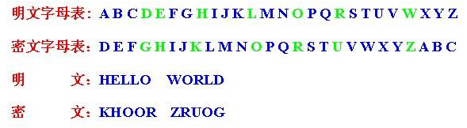
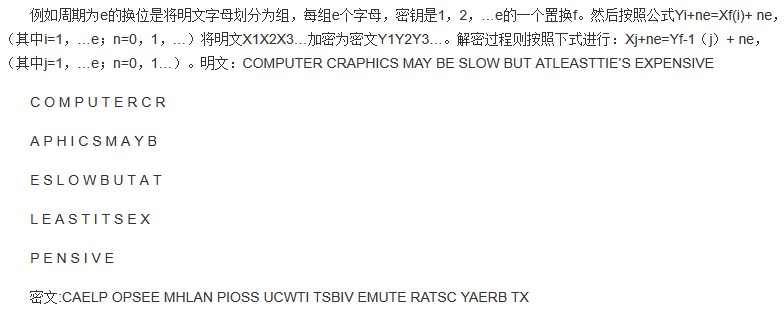

### 密码学预热
逻辑或 

只要有一个为真即为真

1001或1100 结果为1101

逻辑与 

需要两个都为真才是真

1001与1110 结果为1000

逻辑非 

反着来

1110 非 0001

逻辑异或 

如果两个位不相同则为1，相同则为0，可看为不进位的加法

1101 异或 1010 结果为0111

逻辑异

按位加（即不进位的加法）

逻辑加

也就是或（两者同时为0方为0）

明码：可以直接看到的

补码：原码为正时补码同原码一样，原码为负时，符号位不变，取反加1

反码：原码1变0,0变1
明文：没有加密的文字

密文：加密的文字

公钥与私钥：公钥加密的内容只能用私钥解密，用私钥加密的内容只能 用公钥解密。

   比如说，我要给你发送一个加密的邮件。首先，我必须拥有你的公钥，你也必须拥有我的公钥。
      首先，我用你的公钥给这个邮件加密，这样就保证这个邮件不被别人看到，而且保证这个邮件在传送过程中没有被修改。你收到邮件后，用你的私钥就可以解密，就能看到内容。
      其次我用我的私钥给这个邮件加密，发送到你手里后，你可以用我的公钥解密。因为私钥只有我手里有，这样就保证了这个邮件是我发送的。
      当A->B资料时，A会使用B的公钥加密，这样才能确保只有B能解开，否则普罗大众都能解开加密的讯息，就是去了资料的保密性。验证方面则是使用签 验章的机制，A传资料给大家时，会以自己的私钥做签章，如此所有收到讯息的人都可以用A的公钥进行验章，便可确认讯息是由 A 发出来的了。

http://blog.csdn.net/bberdong/article/details/41079739
http://blog.csdn.net/tanyujing/article/details/17348321

密钥空间（密钥数量）
加密密钥大小的范围。通常以位为单位，即以位的多少来对独特密钥进行计数。密钥的位越长，其密钥空间也就越大。例如：当密钥长度为r时，密钥空间有2的r次方个元素。

凯撒密码
基本思想是：通过把字母移动一定的位数来实现加密和解密。明文中的所有字母都在字母表上向后（或向前）按照一个固定数目进行偏移后被替换成密文。例如，当偏移量是3的时候，所有的字母A将被替换成D，B变成E，以此类推X将变成A，Y变成B，Z变成C。由此可见，位数就是凯撒密码加密和解密的密钥。
特定的当偏移量为3时才是凯撒密码。

简单替换密码
采用字母表的任何排列组合作为密钥

换位密码
与明文的字母保持相同，区别是顺序被打乱了。

分组密码
分组密码是将明文消息编码表示后的数字（简称明文数字）序列，划分成长度为n的组（可看成长度为n的矢量），每组分别在密钥的控制下变换成等长的输出数字（简称密文数字）序列。

对称密码
采用单钥密码系统的加密方法，同一个密钥可以同时用作信息的加密和解密，这种加密方法称为对称加密，也称为单密钥加密。对称密码术通常需要在一个受限组内共享密钥并同时维护其保密性。

公钥密码
公钥密码又称为非对称密码，拥有公钥密码的用户分别拥有加密密钥和解密密钥。通过加密密钥不能得到解密密钥。并且加密密钥是公开的。
与对称密码相反

单向散列函数
单向散列函数，又称单向Hash函数、杂凑函数，就是把任意长的输入消息串变化成固定长的输出串且由输出串难以得到输入串的一种函数。这个输出串称为该消息的散列值。一般用于产生消息摘要，密钥加密等.

消息验证码
密码学中，通信实体双方使用的一种验证机制，保证消息数据完整性的一种工具。构造方法由M.Bellare提出，安全性依赖于Hash函数，故也称带密钥的Hash函数。消息认证码是基于密钥和消息摘要所获得的一个值，可用于数据源发认证和完整性校验。
在发送数据之前，发送方首先使用通信双方协商好的散列函数计算其摘要值。在双方共享的会话密钥作用下，由摘要值获得消息验证码。之后，它和数据一起被发送。接收方收到报文后，首先利用会话密钥还原摘要值，同时利用散列函数在本地计算所收到数据的摘要值，并将这两个数据进行比对。若两者相等，则报文通过认证。

数字签名
数字签名（又称公钥数字签名、电子签章）是一种类似写在纸上的普通的物理签名，但是使用了公钥加密领域的技术实现，用于鉴别数字信息的方法。一套数字签名通常定义两种互补的运算，一个用于签名，另一个用于验证。
数字签名，就是只有信息的发送者才能产生的别人无法伪造的一段数字串，这段数字串同时也是对信息的发送者发送信息真实性的一个有效证明。
数字签名技术是将摘要信息用发送者的私钥加密，与原文一起传送给接收者。接收者只有用发送者的公钥才能解密被加密的摘要信息，然后用HASH函数对收到的原文产生一个摘要信息，与解密的摘要信息对比。如果相同，则说明收到的信息是完整的，在传输过程中没有被修改，否则说明信息被修改过，因此数字签名能够验证信息的完整性。

 数字证书
数字证书就是互联网通讯中标志通讯各方身份信息的一串数字，提供了一种在Internet上验证通信实体身份的方式，数字证书不是数字身份证，而是身份认证机构盖在数字身份证上的一个章或印（或者说加在数字身份证上的一个签名）。它是由权威机构——CA机构，又称为证书授权（Certificate Authority）中心发行的，人们可以在网上用它来识别对方的身份。

伪随机数发生器
伪随机数发生器用于在系统需要随机数的时候，通过一系列种子值计算出来的伪随机数。因为生成一个真正意义上的“随机数”对于计算机来说是不可能的，伪随机数也只是尽可能地接近其应具有的随机性，但是因为有“种子值”，所以伪随机数在一定程度上是可控可预测的

